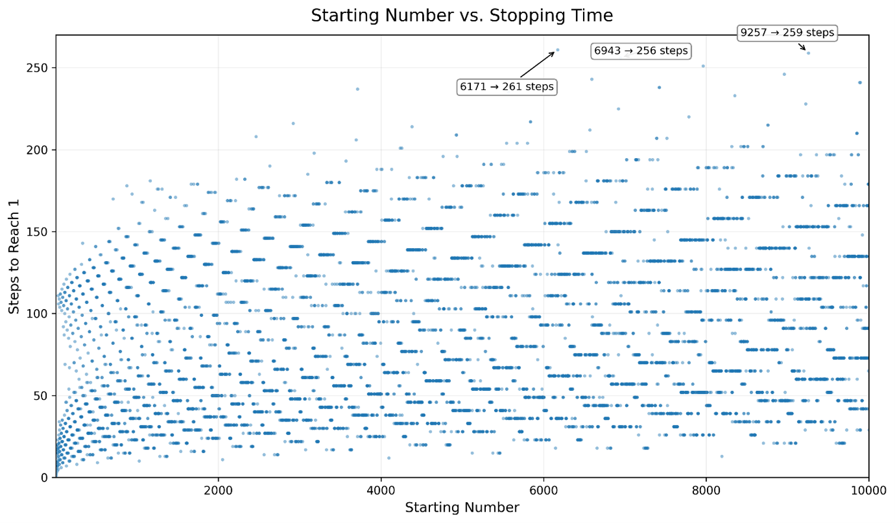
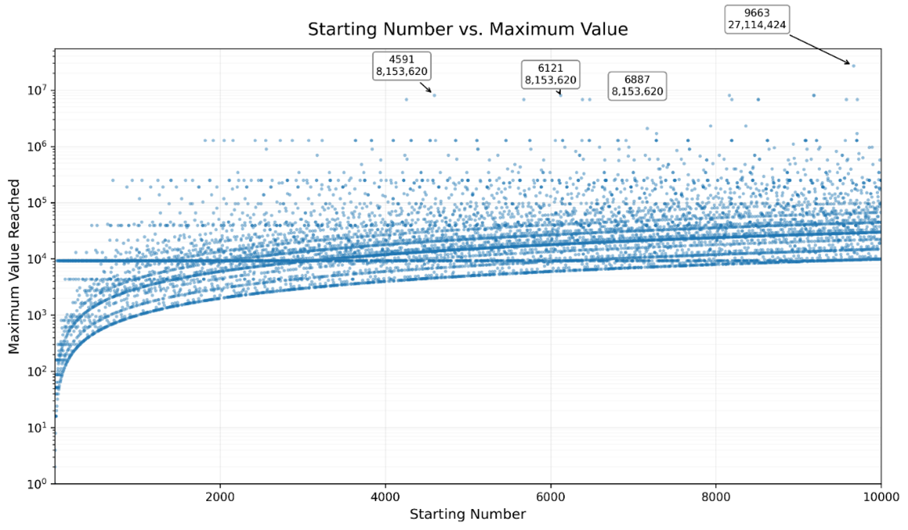
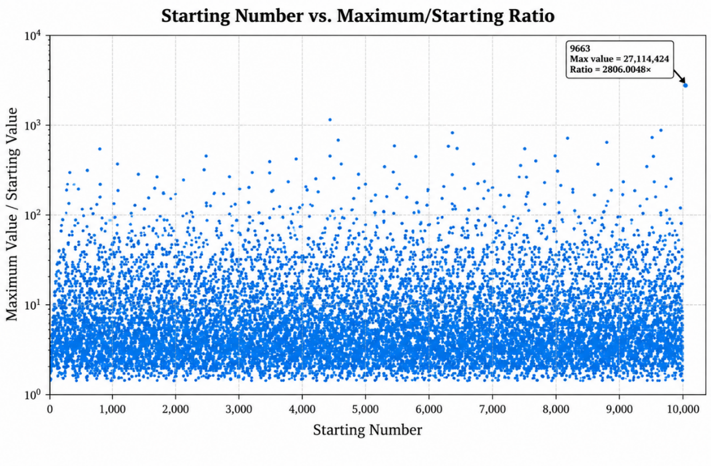

# A Computational Investigation of the Collatz Conjecture

I started this investigation to look at Collatz sequences for every starting number from one to ten thousand.

## Abstract

The Collatz Conjecture is a long‑standing puzzle in mathematics. It asks what happens when we follow a rule on an integer. For any integer n the Collatz rule says:
- If n is even replace n with n divided by two.
- If n is odd replace n with three times n plus one.
We keep applying this rule until the number becomes one.
This project does not try to prove the Collatz Conjecture. Instead it checks how steps each starting number takes to reach one, what the biggest number in each sequence becomes and how large that biggest number is compared to the starting number.

## Research Questions

I asked these questions while running the program:
1. How does stopping time change as the starting number changes?
2. How high can the maximum value of a sequence climb to its starting number?
3. Which starting numbers give the longest stopping times or the biggest maximum values?
4. Is there a link between starting number and stopping time?

## Dataset

The dataset holds the results for every integer from one to ten thousand.
For each starting number the following data were saved:
- Starting number
- Stopping time (how steps until one)
- Maximum value reached
After that I calculated the ratio of maximum value to starting number:
Maximum value ÷ Starting number
The full file is in:
data/collatz_data.csv

## Methodology

I wrote a Python script that implements the Collatz rule.
For each starting integer a:
1. Set the value to a.
2. If the current value is even divide it by two.
3. If the current value is odd compute three times the value plus one.
4. Count each rule application as one step.
5. Record the value reached.
6. Repeat until the sequence reaches one.
7. Run the process for every starting number from one to ten thousand.
After the script finished I used Python again to analyze the data.

## Results

I made three scatter plots to see how the sequences behave.
### Figure 1. Starting Number vs. Stopping Time
This plot shows the link between starting number and the number of steps needed to reach one.

### Figure 2. Starting Number vs. Maximum Value
Here I plotted the value each Collatz sequence reaches. Because those maxima vary a lot I used a scale on the y‑axis.

### Figure 3. Starting Number vs. Maximum/Starting Ratio
This plot looks at how a sequence grows when compared with its starting number. The vertical axis is logarithmic because the ratios differ widely.
The striking outlier appears at starting number 9663. That sequence goes up to 27,114,424 giving a maximum‑to‑starting‑value ratio of 2806.0048.

## Statistical Analysis
I ran statistical tests on the data:
- Mean stopping time
- Median stopping time
- Mean maximum value
- Median maximum value
- Mean maximum‑to‑starting‑value ratio
- Median maximum‑to‑starting‑value ratio
I also calculated correlation to see if starting number and stopping time move together linearly.
The code, for these analyses lives in the code/ directory.

## Repository Structure

A-Computational-Investigation-of-the-Collatz-Conjecture/
├── code/
│   ├── generate_dataset.py
│   ├── data_analysis.py
│   └── correlation.py
├── data/
│   └── collatz_data.csv
├── figures/
│   ├── figure_1_stopping_time.png
│   ├── figure_2_maximum_value.png
│   └── figure_3_maximum_starting_ratio.png
├── paper/
│   └── Collatz_Conjecture_Research_Paper.pdf
└── README.md
